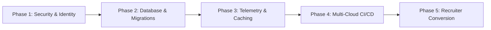

# Strategic Engineering Recommendations & Architecture Roadmap

**Platform:** Abeeb Oladipupo Portfolio Platform  
**Target Architecture:** Production-Grade, Zero-To-Low-Cost, High-Performance Full-Stack System  
**Stack:** React 19 • TypeScript • Tailwind CSS • Vite • Spring Boot 3.4.1 • PostgreSQL • Redis • Cloudinary  

---

## 1. Executive Summary

This document establishes the strategic architectural recommendations and phased roadmap for scaling the Abeeb Oladipupo Portfolio Platform from a personal showcase into an enterprise-caliber product platform. 

The recommendations are prioritized to deliver maximum engineering impact, reliability, operational security, and recruiter conversion without incurring prohibitive recurring SaaS expenses.

---

## 2. Strategic Pillars & Phased Roadmap



---

### Pillar 1: Security & Identity Governance (Priority: Immediate / High)

#### Current State
- The backend API endpoints (`POST /api/v1/projects`, `POST /api/v1/media/upload`) are publicly accessible without authentication.
- Admin overview exposes role metadata without session checks.

#### Strategic Recommendations
1. **Spring Security 6 + Stateless JWT Authentication**:
   - Implement an asymmetric RS256 or HMAC-SHA256 token verification scheme.
   - Restrict project mutations (`POST`, `PUT`, `DELETE /api/v1/projects`) and admin endpoints to the `ROLE_ADMIN` authority.
   - Keep public read endpoints (`GET /api/v1/projects`, `GET /api/v1/metrics`, `GET /api/v1/resume`) open with rate limiting.
2. **Cloudinary Signed Upload Signatures**:
   - Instead of relying on client-side unsigned upload presets in the frontend, generate an ephemeral HMAC-SHA256 signature in Spring Boot (`POST /api/v1/media/signature`) using `CLOUDINARY_API_SECRET`.
   - The browser uploads directly to Cloudinary using the short-lived signature, avoiding exposing secrets while preventing unauthorized asset spam.
3. **HTTP Security Headers & Content Security Policy (CSP)**:
   - Implement strict security response headers via Spring Boot or CDN edge:
     - `Content-Security-Policy: default-src 'self'; frame-ancestors 'none';`
     - `Strict-Transport-Security: max-age=63072000; includeSubDomains; preload`
     - `X-Content-Type-Options: nosniff`
     - `Referrer-Policy: strict-origin-when-cross-origin`

---

### Pillar 2: Database Persistence & Evolution (Priority: High)

#### Current State
- The application uses H2 in-memory mode for development and provides raw SQL in `portfolio_schema.sql`.
- Hibernate DDL auto is set to `update`, which is prone to drift or accidental data modification in production environments.

#### Strategic Recommendations
1. **Flyway Database Migrations**:
   - Replace `hibernate.ddl-auto=update` with Flyway versioned migrations (`V1__initial_schema.sql`, `V2__add_project_year.sql`, `V3__owner_profiles.sql`).
   - Ensures immutable, reproducible schema evolution across local development, staging, and production databases (Neon/Supabase/AWS RDS).
2. **HikariCP Connection Pool Optimization**:
   - Configure conservative pool settings suited for serverless or containerized tiers:
     ```properties
     spring.datasource.hikari.maximum-pool-size=10
     spring.datasource.hikari.minimum-idle=2
     spring.datasource.hikari.idle-timeout=30000
     spring.datasource.hikari.connection-timeout=20000
     spring.datasource.hikari.max-lifetime=1800000
     ```
3. **Query Optimization & JPA Indexing**:
   - Add explicit database indices on foreign keys, `slug` lookups, and `created_at` sorting fields:
     ```sql
     CREATE INDEX idx_portfolio_projects_created_at ON portfolio_projects(created_at DESC);
     CREATE INDEX idx_portfolio_projects_slug ON portfolio_projects(slug);
     ```

---

### Pillar 3: Telemetry, Observability & Caching (Priority: Medium-High)

#### Current State
- `PortfolioMetricsService` caches basic metrics as a concatenated string (`total|views|status`) in Redis.
- If Redis is offline, fallback metrics are returned gracefully.

#### Strategic Recommendations
1. **JSON Serialization & Cache Invalidation Lifecycle**:
   - Store typed JSON objects in Redis using `GenericJackson2JsonRedisSerializer` instead of delimited strings.
   - Implement automatic cache eviction using `@CacheEvict(value = "metrics", allEntries = true)` whenever a project is added or edited.
2. **Spring Boot Actuator & Prometheus Metrics**:
   - Expose standard Actuator endpoints (`/actuator/health`, `/actuator/metrics`, `/actuator/prometheus`).
   - Monitor JVM heap allocation, GC pauses, Hikari connection usage, and HTTP request percentiles (p50, p95, p99).
3. **Structured Logging with Correlated Trace IDs**:
   - Implement Slf4j MDC (Mapped Diagnostic Context) to attach a unique `traceId` and `requestId` to every incoming request.

---

### Pillar 4: Zero-Cost / High-Availability Deployment Architecture

#### Current State
- Separate frontend and backend repositories without automated continuous deployment configuration.

#### Recommended Cloud Topology
| Component | Hosting Provider | Tier / Strategy |
| :--- | :--- | :--- |
| **Frontend SPA** | **Vercel** or **Cloudflare Pages** | Free tier, Global Edge CDN, automated branch previews |
| **Backend API** | **Render** or **Railway** | Dockerized container, automatic sleeping or low-cost worker |
| **Database** | **Neon** or **Supabase** | Managed PostgreSQL with connection pooling & automated backups |
| **Redis Cache** | **Upstash Redis** | Serverless Redis (free 10,000 commands/day), zero idle cost |
| **Media Assets** | **Cloudinary** | Free tier (25 GB managed bandwidth/month) |

#### Edge Routing & Domain Architecture
- Point apex domain (`abeeboladipupo.dev`) to Cloudflare DNS.
- Route `/api/*` requests through Cloudflare reverse proxy to the backend API (`api.abeeboladipupo.dev` or path-based rewrite) to eliminate cross-origin complexity entirely.

---

### Pillar 5: Developer Experience, Testing & CI/CD (Priority: Medium)

#### Strategic Recommendations
1. **Automated GitHub Actions Pipeline (`.github/workflows/ci.yml`)**:
   - Trigger on every pull request and push to `main`.
   - **Frontend Job**: `oxlint` &rarr; `tsc -b` &rarr; `vite build`.
   - **Backend Job**: Java 21 setup &rarr; `./mvnw clean test` with Mockito and Testcontainers.
2. **Integration Testing with Testcontainers**:
   - Run integration tests (`ProjectRepositoryIntegrationTest`) against a real PostgreSQL Docker container in CI rather than relying solely on in-memory H2.
3. **Automated Release Tagging**:
   - Use semantic release tagging to version frontend and backend builds automatically on merge.

---

### Pillar 6: Recruiter Engagement & Conversion Strategy

#### Strategic Recommendations
1. **Template-Driven Resume Downloads**:
   - Completed: Added specialized presets (`Cloud Solutions Architect`, `Full-Stack Product Engineer`, `ATS Executive Technical Lead`).
   - Downloads dynamically format Word (.doc) and PDF documents matching the selected profile emphasis.
2. **Interactive Live Sandboxes Over Static Screenshots**:
   - Completed: Replaced non-interactive iframes with real simulated testing sandboxes for Observability, CI/CD pipelines, and postMessage protocols.
3. **Analytics Tracking on Recruiter Actions**:
   - Log anonymous telemetry events when recruiters download resumes or interact with project demos to evaluate recruiter engagement and hiring interest.
